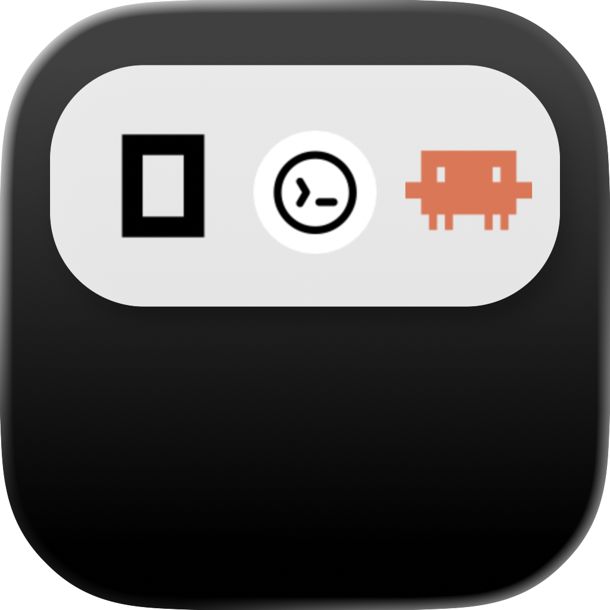

<div align="center">
  
  <h1 align="center">VibeHUD</h1>

  <p align="center">
    A macOS notch overlay for Claude Code that keeps your sessions, approvals, replies, and updates within reach.
  </p>
  
[](https://github.com/section9-lab/VibeHUD/releases/latest)
[](LICENSE)
[](https://github.com/section9-lab/VibeHUD/stargazers)
[](https://github.com/section9-lab/VibeHUD/network/members)


[](https://ko-fi.com/jack)
[](https://www.patreon.com/jack)

</div>

## What it does

VibeHUD gives Claude Code a fast, ambient control surface on macOS. Instead of bouncing back and forth between your terminal and system prompts, you get a floating HUD for watching sessions, handling approvals, replying to prompts, and checking updates.

## Product highlights

- Live session HUD for multiple Claude Code sessions
- Approve or deny tool requests from the notch
- Answer `AskUserQuestion` prompts without leaving the workflow
- Open chat history and review conversations in-app
- Send replies back to Claude sessions from the HUD
- Works with tmux, Terminal.app, iTerm2, and Ghostty
- Choose your display, sound, Claude directory, and startup behavior
- Optional sensor helper for tap and vibration-based actions
- Built-in update checks and installs through Sparkle

## Main workflows

### Stay on top of active sessions

VibeHUD watches your Claude Code activity in real time and keeps the important state visible: running work, waiting input, approvals, and recently active sessions.

### Handle approvals faster

When Claude needs permission to use a tool, VibeHUD brings the approval flow to the notch so you can allow or deny it immediately.

### Reply without context switching

When a session needs an answer, you can respond from the HUD instead of manually hunting for the right terminal pane.

### Review conversations in one place

You can open a session view to see history, follow progress, and keep track of what Claude has been doing.

## Requirements

- macOS 15.6+
- Claude Code installed

## Install

Download the latest release from the GitHub releases page and move `VibeHUD.app` into `/Applications`.

On first launch, VibeHUD installs the Claude Code hooks it needs automatically.

Release downloads:
- https://github.com/section9-lab/VibeHUD/releases/latest

## Settings

From the notch menu, you can configure:

- preferred screen
- notification sound
- Claude config directory
- launch at login
- hooks on or off
- update checks and installs
- optional sensor helper access and sensitivity

## Compatibility

VibeHUD is built around Claude Code on macOS and can route replies through the environments it detects, including:

- bridge mode
- tmux
- Terminal.app
- iTerm2
- Ghostty
- accessibility fallback when needed

Some convenience features depend on your setup. For example, terminal focusing can benefit from tmux and optional window-management tooling, and sensor interactions depend on the helper being enabled and approved.

## Claude directory support

VibeHUD works with the current Claude config layout and can resolve the config directory from:

1. `CLAUDE_CONFIG_DIR`
2. the directory you pick in VibeHUD
3. `~/.config/claude`
4. `~/.claude`

## Updates

VibeHUD uses Sparkle for in-app updates, so installed builds can check for new versions and install them from the app.

## Privacy

VibeHUD uses Mixpanel for product analytics such as app version, build number, macOS version, and Claude Code version metadata. The README should not promise that conversation content is collected, and the app is intended to track product usage rather than your chat transcripts.

## Build from source

For a release-style local build:

```bash
./scripts/build.sh
```

To package a notarized release DMG:

```bash
./scripts/create-release.sh
```

## License

Apache 2.0
